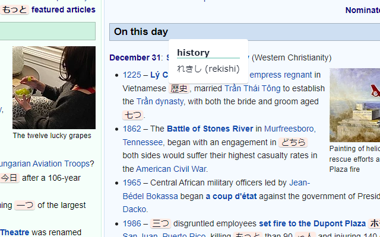
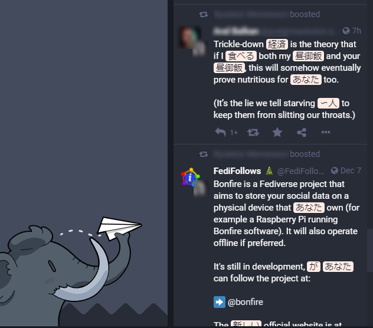

# Oumu - Learn Japanese browsing websites

**Oumu** is a simple Chrome extension which replaces English words on websites
with Japanese equivelants. It uses vocabulary found in popular books like the
Genki series. The extension allows you to choose which Genki chapters you would
like to include.

Note that the extension only replaces single words, not phrases, and several
words have been ommitted to avoid confusion.

The extension works with nearly every website and webapp, including Twitter,
Facebook and Mastodon!

## Installation

### Chrome Web Store

You can install the extension via the [Chrome Web Store](https://chrome.google.com/webstore/detail/uomo/kkhahmacbkjlohaicgacpjnbbcfldljk).

### Manual installation

Clone or download the repo, run `npm install` and then `npm run build`. The
extension will be built in folder `extension`.

You can then load the extension by going to
[chrome://extensions](chrome://extensions), enabling "developer mode" (top right
corner) and clicking "Load unpacked" to select the extension folder.

## Usage

Click on the extension icon to enable/disable text replacement, and to choose
the chapters you would like to enable.

## Roadmap
Things which are planned to be added in the future:
- Ability to whitelist/blackilist sites
- Custom word lists
- Romaji for all words

## Changelog
### 0.1.1
* Update dependencies
* Update `.eslintrc` to use `@typescript-eslint/indent`
### 0.1.0
* Add blacklisted elements to avoid issues on certain websites (e.g. Reddit's
and Medium's WYSIWYG editor)
### 0.0.2
* Improve the way default settings are created
### 0.0.1
* Initial release
